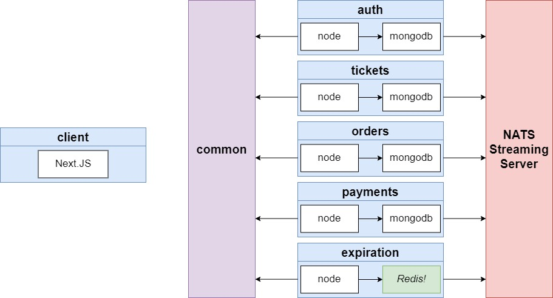

# Ticketing Dev

This project is a ticketing platform where users can list, buy, and sell tickets for events like concerts and sports. 
It demonstrates a microservices architecture with communication through NATS Streaming Server, following event-driven design principles.

## Features 

- Users can list a ticket for an event (concert, sports) for sale. 
- Other users can purchase tickets. 
- Any user can list tickets for sale and purchase tickets. 
- When a user attempts to purchase a ticket, the ticket is 'locked' for 15 minutes. The user has 15 minutes to enter their payment information. 
- While locked, no other user can purchase the ticket. After 15 minutes, the ticket unlocks. 
- Ticket prices can be edited if they are not locked.

## System Architecture 

The following diagram showcases the high-level design of the microservices architecture: 

## Tech Stack 

- **Client**: Next.js 
- **Backend Services**: Node.js, MongoDB, Redis, NATS Streaming Server
- **Languages**: TypeScript & JavaScript
- **Tools**: Docker, Kubernetes, Jest, Supertest 
- **Authentication**: JWT-based auth system 
- **Testing**: Unit & integration tests with Jest & Supertest 

## Services

1. **Auth Service**: /api/users/ 
	- Handles everything related to user sign-up, sign-in, and sign-out.
2. **Tickets Service**:
	- Manages ticket creation and editing. 
	- Ensures that tickets can only be updated if they are not locked.
3. **Orders Service**: 
	- Responsible for creating and managing orders. 
	- Connects tickets to users through the purchase process.
4. **Expiration Service**:
	- Monitors orders and cancels them after 15 minutes if no payment is made.
5. **Payments Service**: 
	- Handles payment processing. 
	- Cancels orders if the payment fails, completes them if the payment succeeds.
